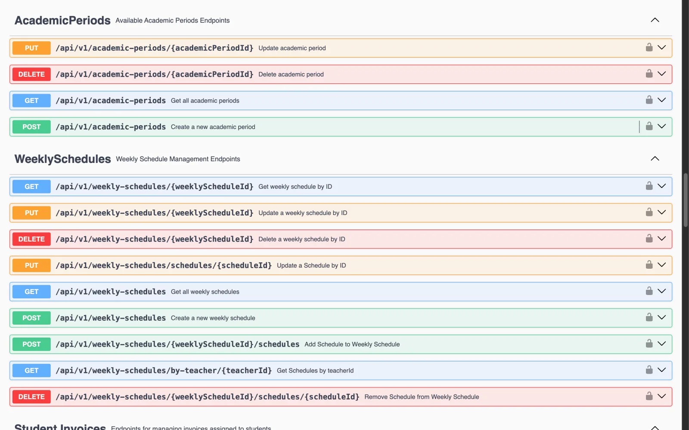

# Demy Web Service

REST API for **Demy**, responsible for authentication and the platform's academic, administrative, and financial operations. It is implemented with Java 21 and Spring Boot and persists data in MySQL.


## Capabilities

| Bounded context | Primary responsibilities |
|---|---|
| `iam` | Academies, administrator and teacher accounts, JWT sign-in, and password recovery. |
| `enrollment` | Students, academic periods, and enrollments. |
| `scheduling` | Courses, classrooms, weekly schedules, and teacher assignments. |
| `attendance` | Class sessions, attendance registration, and reports by student, course, and date range. |
| `billing` | Student invoices, payments, expenses, and financial transactions. |
| `shared` | Shared persistence, auditing, web configuration, and OpenAPI documentation. |

The API base path is `/api/v1`. Except for registration, sign-in, password recovery, payment intent creation, and API documentation, endpoints require a JWT using the `Bearer` authentication scheme.

<details>
<summary>View the endpoint catalog</summary>



</details>

## Architecture

Each bounded context separates responsibilities into four areas:

```text
domain          Domain model, aggregates, value objects, and contracts
application     Command, query, and cross-context application services
infrastructure  JPA persistence, security, and technical adapters
interfaces      REST controllers, resources, and transformations
```

The service uses Spring Data JPA, Spring Security, JWT, Bean Validation, springdoc-openapi, Flyway, and Stripe.

## Requirements

- JDK 21.
- MySQL 8 or newer.
- An environment compatible with the included Maven Wrapper.

## Local setup

1. Create a MySQL database. The development profile expects `demy-db-os` by default.

2. Provide credentials through environment variables. A local session can be configured as follows:

   ```bash
   export SPRING_PROFILES_ACTIVE=dev
   export SPRING_DATASOURCE_URL='jdbc:mysql://localhost:3306/demy-db-os?useSSL=false&allowPublicKeyRetrieval=true&serverTimezone=UTC'
   export SPRING_DATASOURCE_USERNAME='root'
   export SPRING_DATASOURCE_PASSWORD='your-local-password'
   export AUTHORIZATION_JWT_SECRET='a-long-random-secret'
   export STRIPE_SECRET_KEY='your-private-test-key'
   ```

   Never publish real values or add them to the repository.

3. Start the API. Port `8090` matches the local configuration example in `demy-web-app`:

   ```bash
   SERVER_PORT=8090 ./mvnw spring-boot:run
   ```

4. Open the interactive documentation at [http://localhost:8090/swagger-ui/index.html](http://localhost:8090/swagger-ui/index.html). The JSON contract is available at [http://localhost:8090/v3/api-docs](http://localhost:8090/v3/api-docs).

## Verification

```bash
./mvnw test
```

Context and integration tests require a reachable database for the active profile.

## Demy ecosystem

- [`demy-web-app`](https://github.com/smarteduhq/demy-web-app): Angular client for this API.
- [`demy-landing-page`](https://github.com/smarteduhq/demy-landing-page): public product website.
- [`demy-report`](https://github.com/smarteduhq/demy-report): academic report, design decisions, and sprint evidence.
